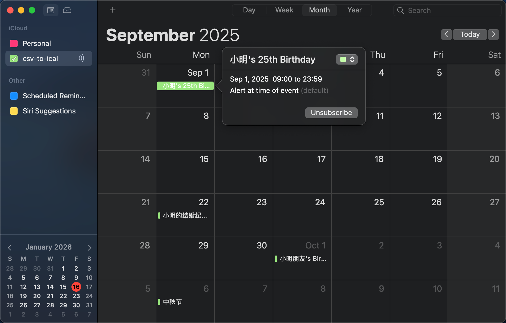

# CSV-to-iCal

[](https://github.com/fantasticmao/csv-to-ical/actions)
[](https://codecov.io/gh/fantasticmao/csv-to-ical)
[](https://hub.docker.com/r/maomao233/csv-to-ical)

[](https://goreportcard.com/report/github.com/fantasticmao/csv-to-ical)
[](https://github.com/fantasticmao/csv-to-ical/releases)
[](https://github.com/fantasticmao/csv-to-ical/blob/main/LICENSE)

README [English](README.md) | [中文](README_ZH.md)

## 这是什么

CSV-to-iCal 是一个基于 Go 语言的可快速部署的 Web 应用程序，用于将 [CSV](https://datatracker.ietf.org/doc/html/rfc4180) 格式的内容转化成 [iCal](https://datatracker.ietf.org/doc/html/rfc5545) 格式的在线订阅链接。例如，你可以通过订阅 URL <https://csv-to-ical.fantasticmao.cn/remote?url=https://raw.githubusercontent.com/fantasticmao/csv-to-ical/main/csv/testdata/calendar_test.csv> 来将 [calendar_test.csv](csv/testdata/calendar_test.csv) 中的日程事件导入到你的 iOS 日历 / Google 日历中。



[csv-to-ical.fantasticmao.cn](https://csv-to-ical.fantasticmao.cn) 是一个为普通用户提供的开箱即用的 CSV-to-iCal 服务实例，实际运行于我家的 HomeLab，并通过 Cloudflare Tunnel 暴露到公网。

CSV-to-iCal 当前支持以下特性：

- [x] 充分尊重用户隐私，不留存任何用户内容，代码 100% 开源和透明
- [x] 支持读取本地 CSV 文件，支持通过 HTTP 协议读取远程 CSV 文件
- [x] 支持公历与农历事件
- [x] 支持计算公历生日事件的周岁年龄，支持计算农历生日事件的虚岁年龄
- [x] 支持英文（默认）、中文两种语言
- [x] 支持最大 5 年的重复日程
- [x] 支持最大 3 年的回溯日程

## 下载安装

<details>
<summary>从源代码编译</summary>

克隆仓库：

```bash
git clone https://github.com/fantasticmao/csv-to-ical.git
cd csv-to-ical
```

开始编译：

```bash
go build -o csv-to-ical .
```

这会将在当前目录生成一个名为 `csv-to-ical` 的可执行文件。

</details>

<details>
<summary>使用 go install</summary>

如果你有 Go 环境，可以直接使用 `go install` 进行安装：

```bash
go install github.com/fantasticmao/csv-to-ical@latest
```

这会将 `csv-to-ical` 命令安装到你的 `GOPATH/bin` 目录下。

</details>

<details open>
<summary>【推荐】使用 Docker</summary>

项目提供了 Docker 镜像，可以通过 Docker 进行部署：

```bash
docker pull maomao233/csv-to-ical:latest
```

然后可以运行容器：

```bash
docker run -d -p 7788:7788 -v /path/to/your/config/:/opt/csv-to-ical/ maomao233/csv-to-ical:latest
```

请确保将 `/path/to/your/config` 替换为你的 `config.yaml` 所在的实际目录。容器内的 `config.yaml` 存放目录为 `/opt/csv-to-ical`。

</details>

## 快速开始

<details open>
<summary>配置 config.yaml</summary>

创建一个配置文件 `config.yaml`，程序默认会在用户目录下的 `.config/csv-to-ical/` 中寻找 `config.yaml`，你也可以通过 `-d` 命令行参数指定配置目录。

以下是一个 `config.yaml` 示例：

```yaml
bind-address: 0.0.0.0:7788 # 程序监听地址和端口，默认为 0.0.0.0:7788

http-client:
  timeout: 3000 # HTTP 客户端超时时间（毫秒），默认为 3000ms
  proxy: ""     # 可选的 HTTP 代理地址，例如 http://127.0.0.1:7890

csv-providers:
  # 'remote' 处理器示例，用于处理远程 CSV 文件
  my-remote-calendar:
    url: "https://raw.githubusercontent.com/fantasticmao/csv-to-ical/main/csv/testdata/calendar_test.csv"
    language: "zh-cn" # 事件语言，可选 "en"（默认）或 "zh-cn"
    recurCnt: 5       # 重复日程的最大年份数，默认为 3，最大 5
    backCnt: 2        # 回溯日程的最大年份数，默认为 1，最大 3

  # 'local' 处理器示例，用于处理本地 CSV 文件
  my-local-calendar:
    file: "/path/to/your/calendar.csv" # 本地 CSV 文件路径
    language: "en"
    recurCnt: 3
    backCnt: 1
```

</details>

<details open>
<summary>启动 CSV-to-iCal</summary>

在项目根目录下运行：

```bash
go run main.go
```

或者，如果你已经安装了二进制文件：

```bash
csv-to-ical -d /path/to/your/config
```

</details>

<details open>
<summary>访问 CSV-to-iCal</summary>

程序启动成功后会输出以下日志，你将可以通过 `bind-address` 中配置的地址访问 CSV-to-iCal。

```
start HTTP server success, bind address: 0.0.0.0:7788
```

</details>

<details open>
<summary>获取 iCal 订阅链接</summary>

通过访问 <http://0.0.0.0:7788/remote?url=...> 或 <http://0.0.0.0:7788/local/my-local-calendar>，可以获取 iCal 订阅链接。

</details>

## 使用说明

**CSV 文件格式**

CSV 文件格式有特殊的要求，应当包含以下列：

| 列名（不区分大小写）                   | 说明   | 格式                                                              | 示例       |
|------------------------------|------|-----------------------------------------------------------------|----------|
| Name                         | 事件名称 | 字符串                                                             | 小明的毕业纪念日 |
| Month                        | 月份   | 整数（1-12）                                                        | 6        |
| Day                          | 日期   | 整数（1-31）                                                        | 1        |
| Year                         | 年份   | 整数                                                              | 2022     |
| Calendar_Type 或 CalendarType | 日历类型 | 类型枚举（solar 公历、lunar 农历、birthday_solar 公历生日、birthday_lunar 农历生日） | solar    |

**CSV 文件示例**

详情请查看 [calendar_test.csv](csv/testdata/calendar_test.csv)。

**使用远程 CSV 文件**

你可以通过 `remote` 接口订阅一个公共可访问的 CSV 文件。例如，如果你有一个公共的 CSV 文件链接 <https://example.com/your-calendar.csv>，你可以使用以下 URL 访问：

```
https://<your-csv-to-ical-host>/remote?url=https://example.com/your-calendar.csv
```

- `url`: 远程 CSV 文件的完整 URL。
- `lang` (可选): 事件语言，`en` (默认) 或 `zh-cn`。
- `recurCnt` (可选): 重复日程的最大年份数，默认为 3，最大 5。
- `backCnt` (可选): 回溯日程的最大年份数，默认为 1，最大 3。

例如，订阅一个中文的重复日程，最多重复五年，最多回溯两年：

```
https://<your-csv-to-ical-host>/remote?lang=zh-cn&recurCnt=5&backCnt=2&url=https://example.com/your-calendar.csv
```

**使用本地 CSV 文件**

如果你想使用本地的 CSV 文件，你需要通过 `config.yaml` 进行配置。在 `csv-providers` 部分添加一个条目，指定 `file` 路径。

例如，在 `config.yaml` 中配置：

```yaml
csv-providers:
  my-local-calendar:
    file: "/path/to/your/calendar_example.csv"
    language: "zh-cn"
    recurCnt: 5
    backCnt: 2
```

然后，你可以通过以下 URL 访问：

```
https://<your-csv-to-ical-host>/local/my-local-calendar
```

这里的 `my-local-calendar` 对应 `config.yaml` 中 `csv-providers` 下的键名。

## 常见的问题和回答

Q: 为什么我的日历事件没有显示？

A: 请检查你的 CSV 文件格式是否正确，特别是 `Name`, `Month`, `Day`, `Year`, `CalendarType` 这些列是否存在且数据格式正确。另外，检查 `config.yaml` 中的 `file` 或 `url` 路径是否正确。

---

Q: 如何启用 HTTPS？

A: CSV-to-iCal 本身不直接提供 HTTPS 功能，建议在前面配置反向代理（如 Nginx, Caddy, Cloudflare Tunnel 等）来处理 HTTPS。

---

Q: `recurCnt` 和 `backCnt` 是什么意思？

A: `recurCnt` (recurrence count) 指定了重复事件将生成的最大年份数（从当前年份开始）。`backCnt` (back count) 指定了回溯事件的最大年份数（从当前年份回溯）。

## 许可声明

CSV-to-iCal [License](https://github.com/fantasticmao/csv-to-ical/blob/main/LICENSE)

Copyright (c) 2023 fantasticmao
